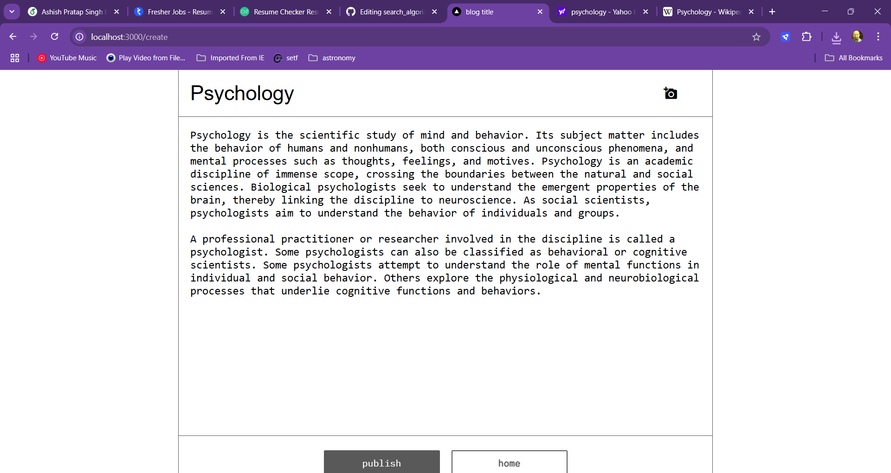
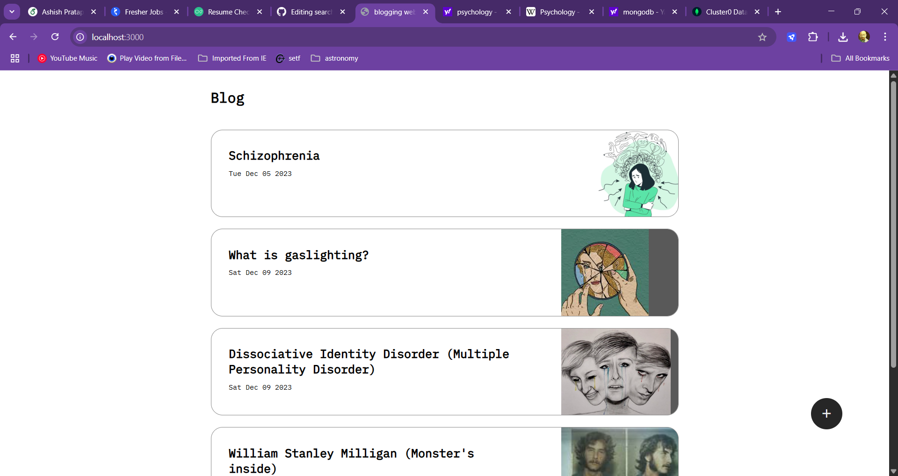
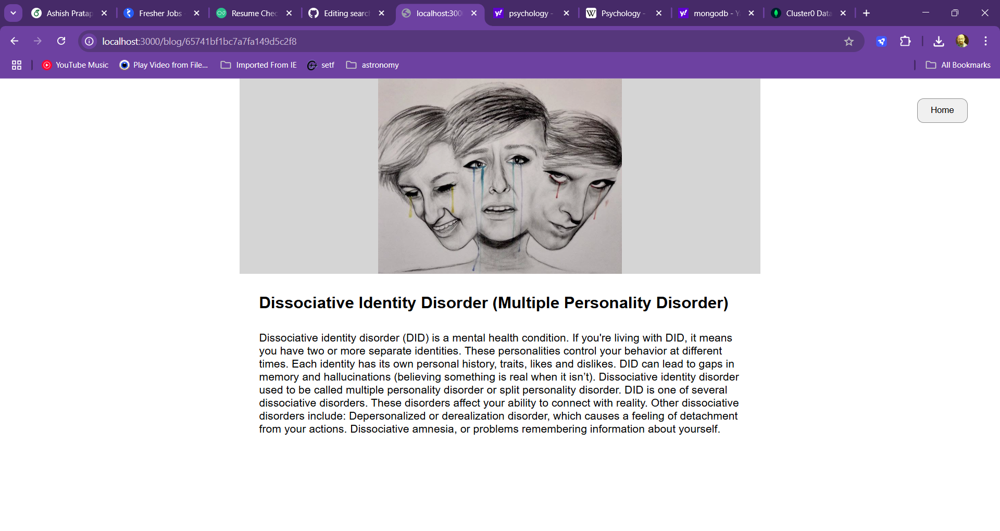

# Blogging Website 

A simple and responsive blogging platform built with HTML, CSS, JavaScript, and MongoDB. This project allows users to read blog posts and manage content through a clean and intuitive interface.

##  Features

-  View and read blog posts
-  Create and Read blog entries
-  Timestamps for each post
-  Fully responsive design
-  MongoDB integration for data persistence

## 🛠 Tech Stack

- **Frontend:** HTML, CSS, JavaScript
- **Backend:** Node.js, Express.js 
- **Database:** MongoDB
- **Tools:** Git, VS Code

## 📸 Screenshots





## 🧑‍💻 Installation

To run this project locally:

```bash
# Clone the repository
git clone https://github.com/Rajnish8292/bloggingWebsite.git
cd bloggingWebsite

# Install dependencies
npm install

# Start the server
node server.js
```

Open http://localhost:3000 to view the Blogging Website in your browser


## Author
Made by Rajnish Raj
### Connect on [LinkedIn](https://www.linkedin.com/in/rajnish-raj-9139602a4/)
